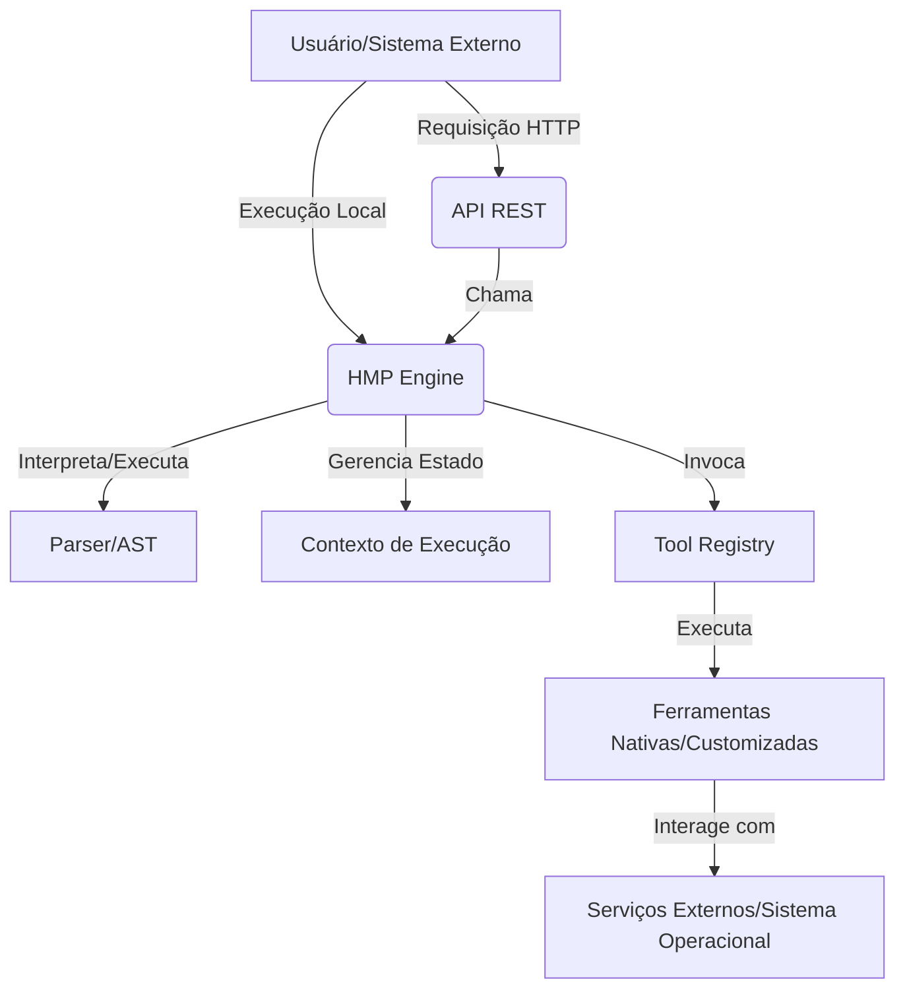

# Arquitetura do OPEN-ROKO

O OPEN-ROKO é um sistema modular projetado para ser flexível, extensível e robusto na automação de fluxos de trabalho. Sua arquitetura é dividida em componentes principais que interagem para interpretar, executar e gerenciar scripts HMP.

## Visão Geral da Arquitetura

O sistema é composto por três módulos principais:

1.  **HMP Engine**: O coração do sistema, responsável pela interpretação e execução dos scripts HMP.
2.  **API REST (Opcional)**: Uma interface web para interagir com o HMP Engine, permitindo a execução de scripts e chamadas de ferramentas via HTTP.
3.  **Ferramentas Auxiliares**: Utilitários e bibliotecas para facilitar o desenvolvimento e a interação com o sistema.

## Componentes Detalhados

### 1. HMP Engine (`HMP/src/hmp/`)

O HMP Engine é o interpretador da linguagem HMP. Ele é responsável por:

-   **Parsing**: Analisar o script HMP e construir uma Árvore de Sintaxe Abstrata (AST).
-   **Execução**: Percorrer a AST, avaliar expressões e executar comandos.
-   **Gerenciamento de Contexto**: Manter o estado da execução, incluindo variáveis, pilha de chamadas e limites de recursos.
-   **Integração de Ferramentas**: Chamar ferramentas externas e funções definidas pelo usuário.

#### Subcomponentes do HMP Engine:

-   **`parser/`**: Contém o `Tokenizer` (responsável por quebrar o script em tokens) e o `Parser` (responsável por construir a AST a partir dos tokens).
    -   `ast.py`: Define as classes para os nós da Árvore de Sintaxe Abstrata (AST).
    -   `parser.py`: Implementa a lógica de parsing para construir a AST.
    -   `tokenizer.py`: Implementa o tokenizador para a linguagem HMP.
-   **`core/`**: Contém a lógica central do motor de execução.
    -   `engine.py`: A classe principal `HMPEngine` que orquestra o parsing, a execução e o gerenciamento de ferramentas.
    -   `context.py`: Define o `ExecutionContext` que armazena variáveis, pilha de chamadas de função e gerencia limites de execução.
-   **`expr/`**: Lida com a avaliação de expressões.
    -   `evaluator.py`: Contém a função `safe_eval_expr` para avaliar expressões Python de forma segura.
    -   `cache.py`: Implementa um cache para expressões avaliadas, otimizando o desempenho.
-   **`tools/`**: Contém as implementações das ferramentas nativas do HMP.
    -   `registry.py`: O `ToolRegistry` que gerencia o registro e a execução de todas as ferramentas disponíveis.
    -   `base.py`: Define a interface `ToolProvider` para a criação de novas ferramentas.
    -   Módulos específicos para cada categoria de ferramenta (ex: `math_tools.py`, `string_tools.py`, `http_tools.py`, etc.).
-   **`runtime/`**: Define exceções e erros específicos do tempo de execução do HMP.

### 2. API REST (`api/`)

A API REST, implementada com Flask, fornece uma interface HTTP para interagir com o HMP Engine. Ela permite:

-   **Execução de Scripts**: Enviar scripts HMP para serem executados e receber os resultados.
-   **Chamada de Ferramentas Diretas**: Invocar ferramentas específicas diretamente via endpoints HTTP.
-   **Monitoramento**: Obter informações sobre o status do motor e métricas de execução.

#### Subcomponentes da API REST:

-   `server.py`: O servidor Flask que define os endpoints da API e integra-se ao `HMPEngine`.
-   `templates/`: Contém templates HTML/CSS para uma interface web básica (se aplicável).

### 3. Ferramentas Auxiliares (`tools/`)

Este diretório pode conter scripts e utilitários que auxiliam no uso e desenvolvimento do OPEN-ROKO, como clientes Python para a API, scripts de exemplo, etc.

-   `hmp_client.py`: Um cliente Python para interagir programaticamente com a API REST do OPEN-ROKO.

## Fluxo de Execução de um Script HMP

1.  **Inicialização**: O `HMPEngine` é instanciado, carregando as configurações e registrando as ferramentas nativas.
2.  **Parsing**: O script HMP é passado para o `Parser`, que o transforma em uma `Program` (AST).
3.  **Registro de Funções**: As funções definidas no script são identificadas e registradas no `ExecutionContext`.
4.  **Execução de Declarações**: O `HMPEngine` percorre a AST, executando cada declaração (`SET`, `CALL`, `IF`, `LOOP`, `FUNCTION`, etc.).
5.  **Avaliação de Expressões**: Quando uma expressão (`${...}`) é encontrada, o `_evaluate_expression` a resolve, utilizando o `safe_eval_expr` e o `ExpressionCache`.
6.  **Chamada de Ferramentas/Funções**: Para comandos `CALL`, o `ToolRegistry` é consultado para executar a ferramenta ou função correspondente, passando os argumentos avaliados.
7.  **Gerenciamento de Escopo**: O `ExecutionContext` gerencia o escopo das variáveis, a pilha de chamadas de função e os limites de execução.
8.  **Retorno**: O resultado final da execução (sucesso/falha, variáveis, valor de retorno) é compilado e retornado.

---

Voltar para [README](../../README.md) | Ver [Sintaxe](syntax.md) | Ver [Tools](tools-reference.md)
